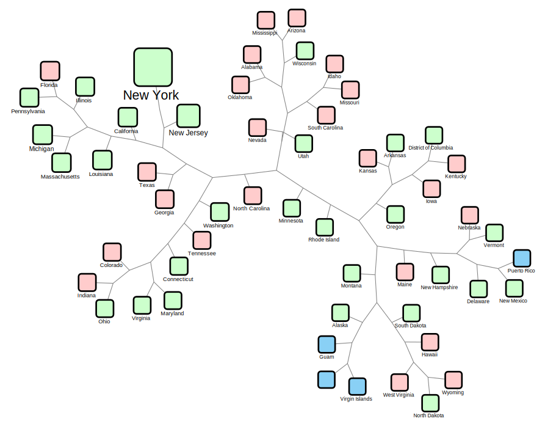
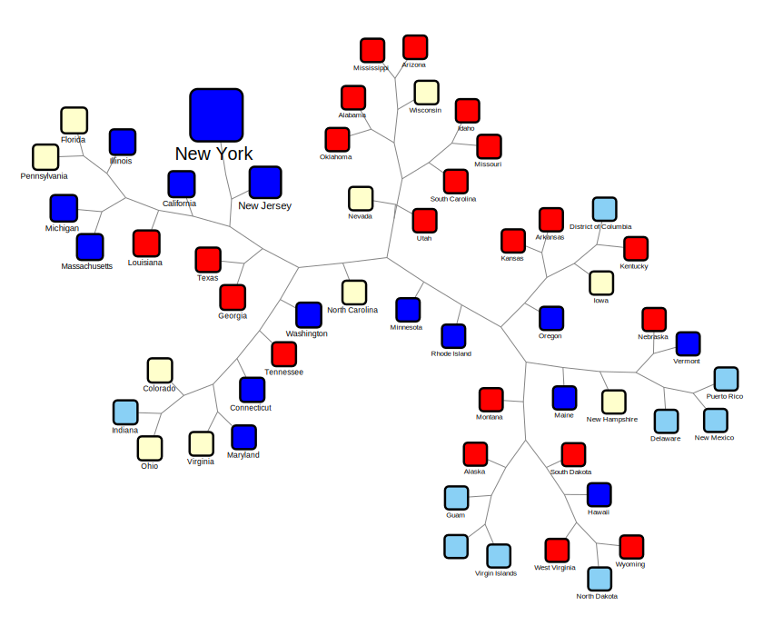
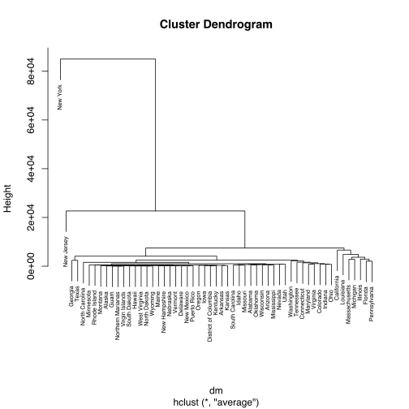

## Covid-19 community transmission similarity network

# UPDATE 4/7: Texas on the way to go past Washington. Washington Reported its first case around Jan 22. Texas reported its first cases around March 5th, about 43 days later. Now, Texas per CDC report today, is at 7276 to Washingtons 7318. Texas is also tightly connected to Washington in our trend similarity network. At this rate, unless Texas takes dramatic containment measures, we predict Texas to go past Washington by this week. (Updated network results below). Please share this info with anyone you know in Texas and plead them to keep listening to the advice Dr. Fauci is giving in TV. Washington is proving that their measures are working. Lets follow their lead. 

### Summary
We generated a network of all US states Covid-19 community transmission data, using DTW as the measure of similarity. We also overlayed the "Most Aggressive States Against the Coronavirus" data on to this network. The results could potentially guide states towards planning for slowing down or avoiding huge covid-19 community transmission.

#### Network - Overlaid with aggressively prepared states info

#### Network - Overlaid with red/blue state info

#### Tree

### Results
The network and tree shows that the states - Massachusetts, New  Jersey, Colorado, Illinois, Georgia, Florida and Louisiana are following the trend of New York, Washington and California, in terms of the Covid-19 confirmed cases. Of these 7 states, Georgia and Florida are rated as below average for their preparedness against coronavirus.

### Data
- [Covid-19 US State-by-State Curated CSV Data](data/time_series_19-covid-Confirmed-us-current.csv)
- [Covid-19 US Transmission Similarity Network - Cytoscape Session File](data/covid-cytoscape-current.cys)
- [Most Aggressive States Against the Coronavirus TSV data](data/covid-state-aggressive-wallethub-march17.txt)
- [Red,Blue,Swing State 2019 info](data/us-red-blue-states-march-2019.txt)

### Method
- For dates until March 10, 2020, the US State-by-state Covid-19 confirmed cases data was obtained from the last available CNN report
- For dates from March 10 to March 17, 2020, the US State-by-state Covid-19 confirmed cases data was extracted from JHU data
- For dates from March 18 2020, the US State-by-state Covid-19 confirmed cases data is extracted from CDC
- For dates after March 20, 2020, weekend case numbers are obtained from the last available CNN report
- The similarity among the states transmission time series data was calculated using the DTW method in R
- The similarity tree was generated in R using hclust 
- The similarity network was generated in R using igraph/RCy3 and analyzed/visualized using Cytoscape
- Network was overlaid with aggressively prepared states data and also with red/blue/swing state information

### Sources
- [Most Aggressive States Against the Coronavirus](https://wallethub.com/edu/most-aggressive-states-against-coronavirus/72307/)
- [CDC](https://www.cdc.gov/coronavirus/2019-ncov/cases-updates/cases-in-us.html)
- [CNN](https://www.cnn.com/2020/03/03/health/us-coronavirus-cases-state-by-state/index.html)
- [JHU](https://github.com/CSSEGISandData/COVID-19)
- [WorldAtlas](www.worldatlas.com/)

### References
1. Dynamic Time Warp - http://dtw.r-forge.r-project.org/
2. RCy3 - https://github.com/cytoscape/RCy3
3. Cytoscape - https://www.ncbi.nlm.nih.gov/pmc/articles/PMC403769/

