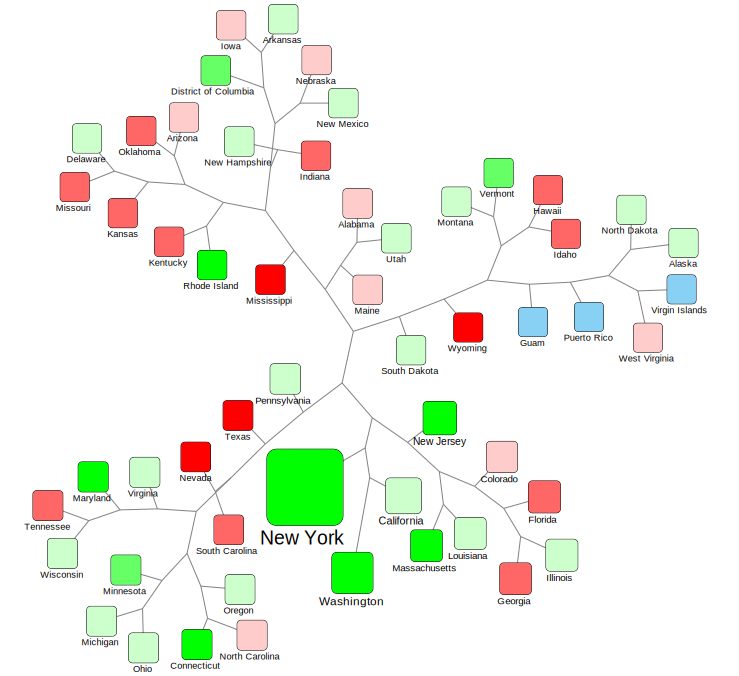

## Covid-19 community transmission similarity network

### Summary
We generated a network of all US states Covid-19 community transmission data, using DTW as the measure of similarity. We also overlayed the "Most Aggressive States Against the Coronavirus" data on to this network.

Results:
Method:
Sources:
References:

[Testlink](https://jekyllrb.com/)

