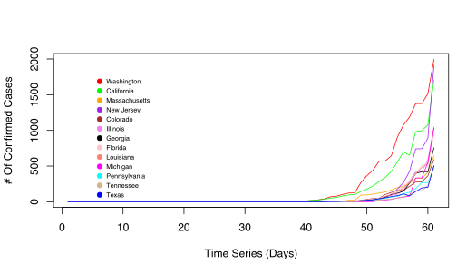

## Covid-19 community transmission similarity network

### Summary
We generated a network of all US states Covid-19 community transmission data, using DTW as the measure of similarity. We also overlayed the "Most Aggressive States Against the Coronavirus" data on to this network. The results could potentially guide states towards planning for slowing down or avoiding huge covid-19 community transmission.

#### Network

#### Tree

### Results
The network and tree shows that the states - Massachusetts, New  Jersey, Colorado, Illinois, Georgia, Florida and Louisiana are following the trend of New York, Washington and California, in terms of the Covid-19 confirmed cases. Of these 7 states, Georgia and Florida are rated as below average for their preparedness against coronavirus.

### Data
- [Covid-19 US State-by-State Curated CSV Data](data/time_series_19-covid-Confirmed-us-current.csv)
- [Covid-19 US Transmission Similarity Network - Cytoscape Session File](data/covid-cytoscape-current.cys)
- [Most Aggressive States Against the Coronavirus TSV data](data/covid-state-aggressive-wallethub-march17.txt)

### Method
- For dates until March 10, 2020, the US State-by-state Covid-19 confirmed cases data was obtained from the last available CNN report
- For dates from March 10 to March 17, 2020, the US State-by-state Covid-19 confirmed cases data was extracted from JHU data
- For dates from March 18 2020, the US State-by-state Covid-19 confirmed cases data is extracted from CDC
- The similarity among the states transmission time series data was calculated using the DTW method in R
- The similarity tree was generated in R using hclust 
- The similarity network was generated in R using igraph/RCy3 and analyzed/visualized using Cytoscape

### Sources
- [Most Aggressive States Against the Coronavirus](https://wallethub.com/edu/most-aggressive-states-against-coronavirus/72307/)
- [CDC](https://www.cdc.gov/coronavirus/2019-ncov/cases-updates/cases-in-us.html)
- [CNN](https://www.cnn.com/2020/03/03/health/us-coronavirus-cases-state-by-state/index.html)
- [JHU](https://github.com/CSSEGISandData/COVID-19)

### References
1. Dynamic Time Warp - http://dtw.r-forge.r-project.org/
2. RCy3 - https://github.com/cytoscape/RCy3 @AlexanderPico
3. Cytoscape - https://www.ncbi.nlm.nih.gov/pmc/articles/PMC403769/

