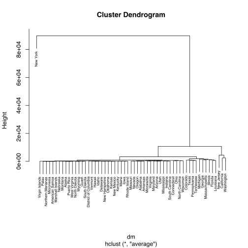

## Covid-19 community transmission similarity network

### Summary
We generated a network of all US states Covid-19 community transmission data, using DTW as the measure of similarity. We also overlayed the "Most Aggressive States Against the Coronavirus" data on to this network. The results could potentially guide states towards planning for slowing down or avoiding huge covid-19 community transmission.

#### Network

#### Tree

### Results
The network and tree shows that the states - Massachusetts, New  Jersey, Colorado, Illinois, Georgia, Florida and Louisiana are following the trend of New York, Washington and California. Of these 7 states, Georgia and Florida are rated as below average for their preparedness against coronavirus.

### Data

### Method

### Sources
- [Most Aggressive States Against the Coronavirus](https://wallethub.com/edu/most-aggressive-states-against-coronavirus/72307/)
- [CDC](https://www.cdc.gov/coronavirus/2019-ncov/cases-updates/cases-in-us.html)
- [CNN](https://www.cnn.com/2020/03/03/health/us-coronavirus-cases-state-by-state/index.html)
- [JHU](https://github.com/CSSEGISandData/COVID-19)

### References

